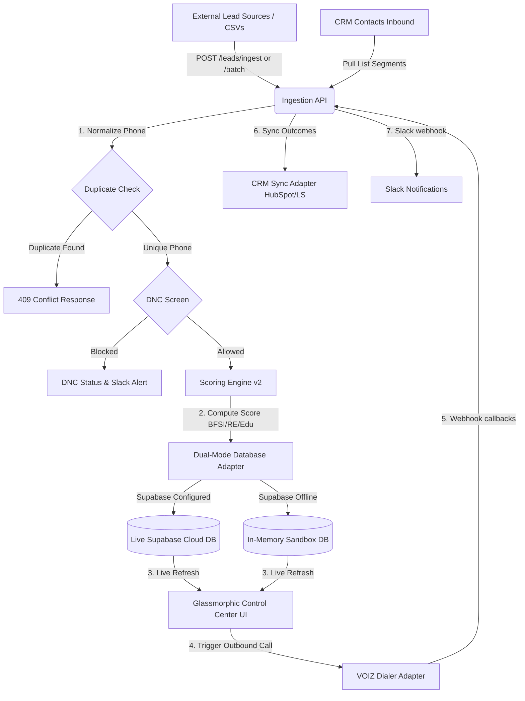

# ⚡ LEADX — AI-Powered Lead Qualification & Conversion Platform

[](https://nodejs.org)
[](https://supabase.com)
[](https://github.com/arpansingha7/LEADX)
[-ff6b6b?style=for-the-badge)](https://github.com/arpansingha7/LEADX)

LEADX is a next-generation AI-powered lead qualification and conversion platform built on top of **VOIZ**—Predixion AI's voice agent telephony infrastructure. While VOIZ handles ASR, TTS, and conversational LLM runtimes, **LEADX** owns the orchestration layer: ingestion pipelines, dynamic intent scoring, onboarding configurations, caller scheduling, DNC screening, CRM integrations, and operations alerting.

Developed by engineering interns **Arpan & Vedika** as part of the engineering program at Predixion AI.

---

## 🎨 System Architecture & Data Flow



---

## 🚀 Key Features Implemented (Modules 1 & 2)

### 1. Client Onboarding & Questionnaire Wizard
*   **Domain-Specific Questionnaire:** New clients select industry templates (**BFSI**, **Real Estate**, or **Education**) and customize campaign goals and instructions.
*   **Self-Serve Column Mapper:** Parses uploaded CSV sheets, maps custom spreadsheet headers (e.g. *Customer Name*, *Mobile Number*) to internal schema fields, and previews the mapped grid live.
*   **DNC Compliance Registry:** Prevents calls to Do Not Call (DNC) numbers at the platform layer.

### 2. Config-Driven Scoring Engine (v2)
*   **Domain-Specific Multipliers:** Scores leads dynamically from `0-100` based on industry profiles:
    *   **BFSI:** Credit scores, monthly income tiers, and requested loan ranges.
    *   **Real Estate:** Budgets, BHK preferences (e.g. 2BHK/3BHK), and center/city locations.
    *   **Education:** Academic qualifications and course interests.
*   **General Fallback:** Evaluates age, city tiers, and standard income fields.
*   **IEEE-754 Safety:** Employs delta checks (`Math.abs(sum - 1.0) <= 0.001`) to protect weights configuration from decimal rounding issues.

### 3. Dual-Mode CRM Integration Hub
*   **HubSpot OAuth 2.0 & Auto-Refresh:** Supports token-based HubSpot authorization with automatic background access token refreshes when expired.
*   **Private Key Support:** Connects securely to HubSpot Private Apps or LeadSquared regional APIs.
*   **Bulk & Manual Push Queues:** Push qualified leads in bulk or individually. Includes a full audit logbook tracking sync statuses.
*   **Direct Inbound Pulling:** Sync lists/segments directly from CRM contacts into the LEADX dialer.

### 4. Glassmorphic Control Dashboard
*   **Visual KPIs & Conversion Funnels:** Displays WoW trends, SLA response times, connect rates, and funnel logs.
*   **Active Waveform Simulator:** Runs simulated active stream call timers and animated speech waveforms in the UI.
*   **Lead Feed & SVG Intent Rings:** Rows animate customized SVG score rings dynamically colored by priority (Hot $\ge$ 80, Qualified $\ge$ 65).

### 5. Central Logbook & Slack Webhook Alerts
*   **Slack Operations Channel:** Sends instant Slack webhook notifications for hot lead ingests, configuration changes, dialing outcomes, and CRM failures.
*   **Audit Trail:** Centralized database audit log mapping all ingestion metrics, manual updates, and CRM sync results.

---

## 🛠️ Technology Choices (Why We Chose This Stack)

| Component | Technology | Product Deciding Factors |
| :--- | :--- | :--- |
| **API / Backend** | **Node.js + Express (ESM)** | Asynchronous event loop; highly efficient for real-time voice webhook streams. |
| **Database** | **Supabase (PostgreSQL)** | Relational schema for ACID-compliant lead state transitions + native JSONB indexing. |
| **Testing** | **Node.js Native Test Runner** | Zero external dependencies, native ES Module support, lightning-fast execution. |
| **Frontend UI** | **Vanilla HTML5 & CSS3** | Custom-built dark theme; zero-overhead execution for custom micro-animations. |
| **Normalizer** | **UUID v4** | Prevents ID enumeration security exploits and sync conflicts. |

---

## 💻 Quick Start & Setup Guide

### 1. Installation
Install core Node dependencies:
```bash
npm install
```

### 2. Database Migration (Supabase Cloud)
1. Create a project in your **[Supabase Dashboard](https://supabase.com)**.
2. Go to the **SQL Editor** tab.
3. Open the local schema file: **[database/schema.sql](database/schema.sql)**.
4. Copy its contents, paste it into the editor, and click **Run**.

### 3. Environment Configuration
Create a `.env` file in the root directory and copy the contents from **[backend/.env.example](backend/.env.example)**. Fill in the keys:
```env
PORT=3000
NODE_ENV=development

# Database Settings (Leave blank to use Mock In-Memory DB)
SUPABASE_URL=https://<your-project-id>.supabase.co
SUPABASE_SERVICE_ROLE_KEY=<your-service-role-key>

# Slack Webhook (Leave blank/mock to fall back to Console stdout logs)
SLACK_WEBHOOK_URL=https://hooks.slack.com/services/mock/webhook/url

# CRM Credentials
HUBSPOT_CLIENT_ID=<your-client-id>
HUBSPOT_CLIENT_SECRET=<your-client-secret>
HUBSPOT_REDIRECT_URI=http://localhost:3000/oauth/hubspot/callback
HUBSPOT_API_KEY=<your-private-app-token>
LEADSQUARED_API_KEY=<your-leadsquared-access-key>
```

### 4. Run Development Server
```bash
npm run dev
```
Open [http://localhost:3000](http://localhost:3000) in your web browser.

### 5. Run Verification Tests
```bash
npm test
```
To run concurrent load-testing stress benchmarks:
```bash
npm run perf
```

---

## 📚 Study Guides & Presentation Documentation

For deeper details, presentation checklists, and study guides:
*   📖 **[LEADX Technical Guide (docs/module1_documentation.md)](docs/module1_documentation.md)** — Core architectures, validations, and Saturday demo scripts.
*   🎙️ **[LEADX Onboarding & CRM Reference (docs/module2_documentation.md)](docs/module2_documentation.md)** — Integration guides, OAuth, DNC registry, and CRM workflows.
