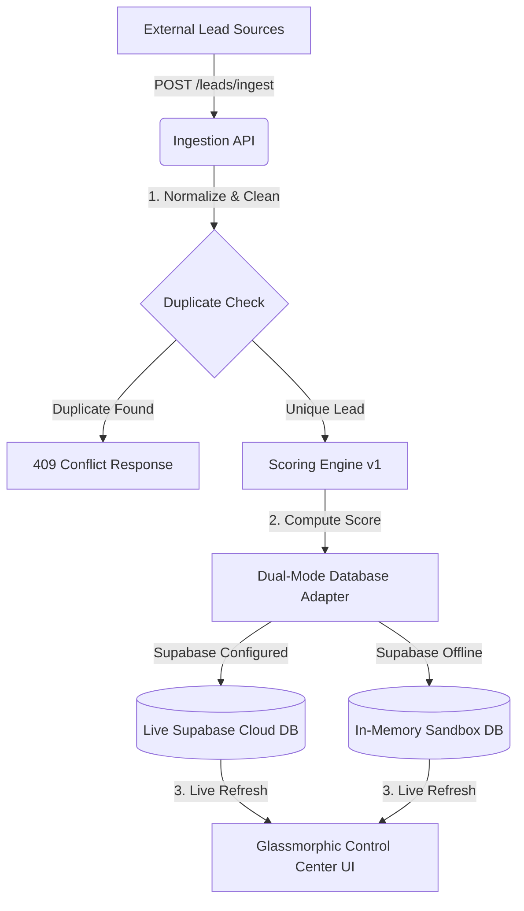

# ⚡ LEADX — AI-Powered Lead Qualification & Conversion Platform

[](https://nodejs.org)
[](https://supabase.com)
[](https://github.com/arpansingha7/LEADX)
[-ff6b6b?style=for-the-badge)](https://github.com/arpansingha7/LEADX)

LEADX is a next-generation AI-powered lead qualification and conversion platform built on top of **VOIZ**—Predixion AI's voice agent telephony infrastructure. While VOIZ handles ASR, TTS, and conversational LLM runtimes, **LEADX** owns the orchestration layer: ingestion pipelines, dynamic intent scoring, caller scheduling, DNC screening, human escalation handoffs, and real-time CRM updates.

Developed by engineering interns **Arpan & Vedika** as part of the 8-week engineering handbook program at Predixion AI.

---

## 🎨 System Architecture & Data Flow



---

## 🚀 Key Features Implemented (Module 1)

### 1. Ingest & Validate Engine
*   **Normalized Phone Parsing:** Cleans spaces, dashes, and brackets down to standard E.164 formats (`+919876543210`).
*   **Double-Defense Deduplication:** Employs application-level checks and a SQL unique index `UNIQUE(tenant_id, phone)` to prevent concurrent race conditions.
*   **Flexible Ingest Endpoints:** Supports single lead ingestion (`POST /ingest`) and high-throughput batch uploads up to 500 leads (`POST /batch`).

### 2. Config-Driven Scoring Engine v1
*   **Multi-Factor Formula:** Scores leads from `0-100` dynamically based on Demographic Fit, Source Quality, Interaction Recency, and Behavioral signals (pages clicked, video watch duration).
*   **Float Rounding Safety:** Implements delta tolerance validation (`Math.abs(sum - 1.0) <= 0.001`) to protect weights configuration from IEEE-754 decimal rounding errors.

### 3. Glassmorphic Control Dashboard
*   **Funnel Tracker:** Displays a 7-stage conversion funnel (Ingested $\rightarrow$ Connected $\rightarrow$ Qualified).
*   **SVG Intent Rings:** Custom SVG circles on rows that animate their stroke offset dynamically according to calculated lead scores.
*   **Interactive Call wave Simulator:** Triggers simulated VOIZ dial handshakes, active stream timers, and live voice waveforms in the CSS layout.
*   **Branded Client Portal:** Co-branded Muthoot Finance workspace showing connect rates, API SLA status, and PDF export simulation.

---

## 🛠️ Technology Choices (Why We Chose This Stack)

| Component | Technology | Product Deciding Factors |
| :--- | :--- | :--- |
| **API / Backend** | **Node.js + Express (ESM)** | Asynchronous event loop; highly efficient at scale for high-frequency incoming webhooks. |
| **Database** | **Supabase (PostgreSQL)** | ACID-compliant relational schema to track lead state transitions + native JSONB indexing. |
| **Testing** | **Node.js Native Test Runner** | Zero external dependencies, native ES Module support, lightning-fast execution (<1.5s). |
| **Frontend UI** | **Vanilla HTML5 & CSS3** | Custom-built dark theme; zero-overhead execution for custom micro-animations (voice waveforms). |
| **Normalizer** | **UUID v4** | Prevents ID enumeration security exploits and sync clashes during offline batch uploads. |

---

## 💻 Quick Start & Setup Guide

### 1. Installation
Install core Node dependencies:
```bash
npm install
```

### 2. Database Migration (Supabase Cloud)
> [!IMPORTANT]
> If you are setting up the live Supabase database for the first time, you must disable Row-Level Security (RLS) on your tables so the publishable API key can read/write data.
1. Create a project in your **[Supabase Dashboard](https://supabase.com/dashboard)**.
2. Go to the **SQL Editor** tab.
3. Open the local schema file: **[database/schema.sql](file:///c:/Users/arpan/OneDrive/Desktop/LEADX/database/schema.sql)**.
4. Copy its contents, paste it into the editor, and click **Run**.

### 3. Environment Configuration
Configure Environment Variables: Create a `.env` file in the root directory and copy the contents from [`.env.example`](file:///c:/Users/arpan/OneDrive/Desktop/LEADX/backend/.env.example). You can use these values for mock integration:
```env
PORT=3000
NODE_ENV=development
SLACK_WEBHOOK_URL=https://hooks.slack.com/services/mock/webhook/url
HUBSPOT_API_KEY=mock-hubspot-api-key
LEADSQUARED_API_KEY=mock-leadsquared-api-key
```

> [!NOTE]
> If you do not specify a `SUPABASE_URL` and `SUPABASE_SERVICE_ROLE_KEY`, the server automatically initializes in offline mock database mode using in-memory arrays. This allows you to test the API immediately.

### 4. Run Development Server
```bash
npm run dev
```
Open [http://localhost:3000](http://localhost:3000) in your web browser.

### 5. Run Validation Tests
Run the integration API test suite:
```bash
npm test
```
Run the concurrent load-testing stress benchmark:
```bash
npm run perf
```

---

## 📚 Study Guides & Presentation Documentation

For deeper details, Saturday presentation checklists, split scripts for Arpan and Vedika, and business/technical interview prep sheets:
*   📖 **[LEADX Module 1 Technical Documentation (docs/module1_documentation.md)](file:///c:/Users/arpan/OneDrive/Desktop/LEADX/docs/module1_documentation.md)**
*   🎙️ **[Live Saturday Demo Pitch Guide & Scripts (docs/module1_documentation.md#5-saturday-mentor-demo-shared-presentation-script)](file:///c:/Users/arpan/OneDrive/Desktop/LEADX/docs/module1_documentation.md#5-saturday-mentor-demo-shared-presentation-script)**
*   💡 **[Intern Core Concepts Study Guide (docs/module1_documentation.md#7-intern-study-guide-core-concepts-examples)](file:///c:/Users/arpan/OneDrive/Desktop/LEADX/docs/module1_documentation.md#7-intern-study-guide-core-concepts-examples)**
