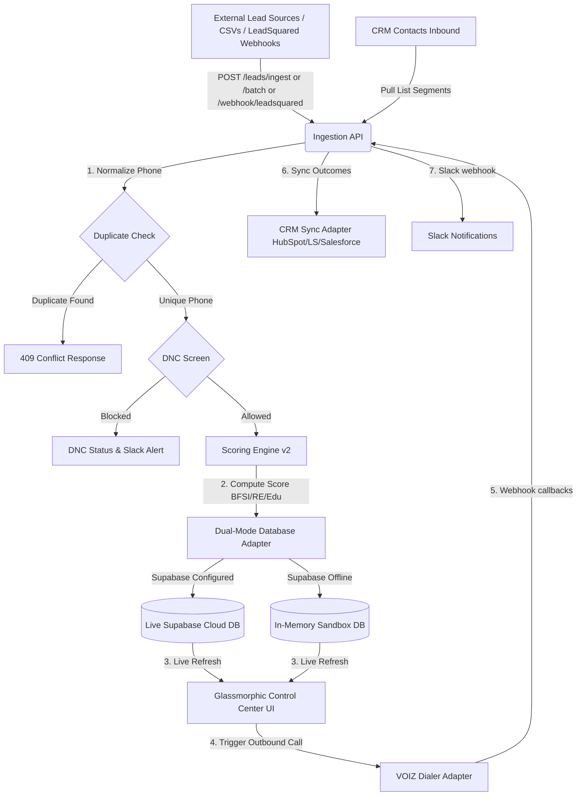

# ⚡ LEADX — AI-Powered Lead Qualification & Conversion Platform

[](https://nodejs.org)
[](https://supabase.com)
[](https://github.com/arpansingha7/LEADX)
[-ff6b6b?style=for-the-badge)](https://github.com/arpansingha7/LEADX)

LEADX is a next-generation AI-powered lead qualification and conversion platform built on top of **VOIZ**—Predixion AI's voice agent telephony infrastructure. While VOIZ handles ASR, TTS, and conversational LLM runtimes, **LEADX** owns the orchestration layer: ingestion pipelines, dynamic intent scoring, onboarding configurations, caller scheduling, DNC screening, CRM integrations, and operations alerting.

Developed by engineering interns **Arpan & Vedika** as part of the engineering program at Predixion AI.

---

## 🎨 System Architecture & Data Flow



---

## 🚀 Key Features Implemented (Modules 1 - 4)

### 1. Ingestion, Phone Normalization, & Lead Scoring (Module 1)
*   **Highly Validated Ingestion:** REST APIs for single (`POST /leads/ingest`) and batch uploads (`POST /leads/batch`) up to 500 leads with automatic E.164 phone normalization.
*   **Dual-Defense Concurrency:** Unique postgres index constraints protect against duplicate records in high-concurrency race conditions.
*   **Multi-Factor Scoring (v2):** Config-driven scoring rules with dynamic delta validations protecting against floating-point math errors.

### 2. Client Onboarding & Spreadsheet Mapper (Module 2)
*   **Domain-Specific Questionnaire:** Clients select templates (**BFSI**, **Real Estate**, or **Education**) mapping custom configurations and guidelines.
*   **Self-Serve Column Mapper:** Ingests raw CSV sheets in the browser, allowing users to map their headers dynamically to internal schema keys.

### 3. Dialer Queue & Priority Call Orchestrator (Module 3)
*   **Asynchronous Priority Worker:** Background worker checks the queue, sorts active leads by score descending, and dispatches them to dialers.
*   **Calling Hours & DNC Compliance:** Restricts dials to **9:00 AM – 8:00 PM IST** (Monday-Saturday) and screens numbers against the platform DNC registry before dialing.
*   **Exponential Backoff Retries:** Automatically reschedules failed calls (e.g. no-answer, busy) with backoff intervals. Gaps are short-circuited to seconds during tests.

### 4. CRM Connectors & LeadSquared Webhooks (Module 4)
*   **Unified CRM Adapter Interface:** HubSpot, LeadSquared, and Salesforce connectors implement a single JavaScript Adapter interface (`readLeads`, `writeActivity`, `updateLeadStatus`).
*   **Salesforce Client Credentials OAuth:** Secures enterprise integrations using Consumer Key and Secret token exchanges.
*   **LeadSquared Webhook Ingestion:** Ingests prospects via signed webhooks secured with HMAC-SHA256 signature verification.
*   **Status Exception Handling:** Audits API rate limits (`429`) and credentials expiration (`401`) errors, sending operations alerts to Slack.

---

## 🛠️ Technology Choices (Why We Chose This Stack)

| Component | Technology | Product Deciding Factors |
| :--- | :--- | :--- |
| **API / Backend** | **Node.js + Express (ESM)** | Asynchronous event loop; highly efficient for real-time voice webhook streams. |
| **Database** | **Supabase (PostgreSQL)** | Relational schema for ACID-compliant lead state transitions + native JSONB indexing. |
| **Testing** | **Node.js Native Test Runner** | Zero external dependencies, native ES Module support, lightning-fast execution. |
| **Frontend UI** | **Vanilla HTML5 & CSS3** | Custom-built dark theme; zero-overhead execution for custom micro-animations. |
| **Normalizer** | **UUID v4** | Prevents ID enumeration security exploits and sync conflicts. |

---

## 💻 Quick Start & Setup Guide

### 1. Installation
Install core Node dependencies:
```bash
npm install
```

### 2. Database Migration (Supabase Cloud)
1. Create a project in your **[Supabase Dashboard](https://supabase.com)**.
2. Go to the **SQL Editor** tab.
3. Open the local schema file: **[database/schema.sql](database/schema.sql)**.
4. Copy its contents, paste it into the editor, and click **Run**.

### 3. Environment Configuration
Create a `.env` file in the root directory and copy the contents from **[backend/.env.example](backend/.env.example)**. Fill in the keys:
```env
PORT=3000
NODE_ENV=development

# Database Settings (Leave blank to use Mock In-Memory DB)
SUPABASE_URL=https://<your-project-id>.supabase.co
SUPABASE_SERVICE_ROLE_KEY=<your-service-role-key>

# Slack Webhook (Leave blank/mock to fall back to Console stdout logs)
SLACK_WEBHOOK_URL=https://hooks.slack.com/services/mock/webhook/url

# CRM Credentials
HUBSPOT_CLIENT_ID=<your-client-id>
HUBSPOT_CLIENT_SECRET=<your-client-secret>
HUBSPOT_REDIRECT_URI=http://localhost:3000/oauth/hubspot/callback
HUBSPOT_API_KEY=<your-private-app-token>
LEADSQUARED_API_KEY=<your-leadsquared-access-key>
```

### 4. Run Development Server
```bash
npm run dev
```
Open [http://localhost:3000](http://localhost:3000) in your web browser.

### 5. Run Verification Tests
```bash
npm test
```
To run concurrent load-testing stress benchmarks:
```bash
npm run perf
```

---

## 📚 Study Guides & Presentation Documentation

For deeper details, presentation checklists, and study guides:
*   📖 **[Module 1 Guide (docs/module1_documentation.md)](docs/module1_documentation.md)** — Ingestion, E.164 phone normalization, weight configurations, and delta validations.
*   🎙️ **[Module 2 Guide (docs/module2_documentation.md)](docs/module2_documentation.md)** — Onboarding questionnaire, dynamic CSV mapping, and HubSpot OAuth.
*   ⚙️ **[Module 3 Guide (docs/module3_documentation.md)](docs/module3_documentation.md)** — Dialer worker loop, calling hours calculations, and exponential backoff retry math.
*   🔌 **[Module 4 Guide (docs/module4_documentation.md)](docs/module4_documentation.md)** — Unified CRM adapters (HubSpot, LeadSquared, Salesforce), credentials flow, and LeadSquared HMAC webhook security.
