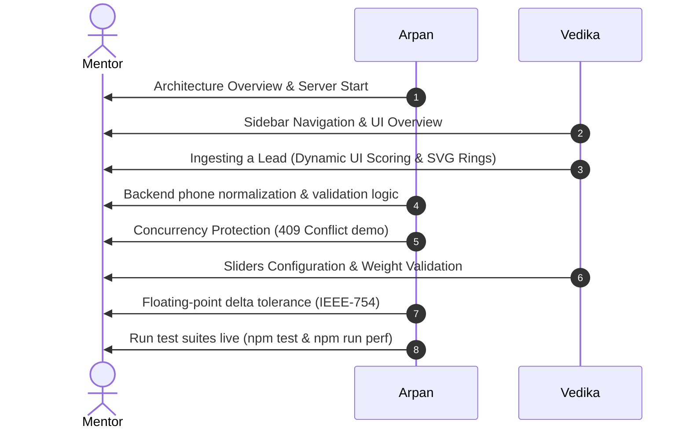

# LEADX Module 1 — Ingestion & Scoring Engine Technical Guide

This document is the official technical reference for the core ingestion and lead scoring capabilities of the LEADX Platform. It outlines the architecture, database constraints, verification steps, Saturday demo script, and core engineering concepts.

---

## 1. Executive Summary & Capabilities

LEADX owns the orchestration layer for Predixion AI's voice agent telephony infrastructure. In Module 1, we implemented the foundational ingestion and scoring pipeline:

*   **Database Infrastructure:** Set up standard SQL tables (`leads`, `call_sessions`, `call_events`, `tenant_configs`, `config_audit_log`) with strict constraints.
*   **Dual-Mode DB Client:** Built a database client that connects to live Supabase cloud databases or falls back to an in-memory database mock for local development and testing.
*   **Lead Ingestion REST Engine:** Highly validated REST endpoints for single (`POST /leads/ingest`) and batch uploads (`POST /leads/batch`) up to 500 leads, including E.164 phone normalization.
*   **Scoring Engine (v1):** Developed a dynamic, config-driven scoring engine that evaluates demographic fit, source quality, recency, behavioral signals, and interaction outcomes against weights.
*   **Glassmorphic Control Dashboard:** Built a sleek multi-page dark-themed dashboard using vanilla HTML, CSS, and JS.
*   **Automated Testing Suite:** Native unit and integration tests combined with high-concurrency load testing stress benchmarks.

---

## 2. Technology Stack & Design Decisions

*   **API / Backend: Node.js + Express (ESM)**
    *   *Decision:* Express runs on Node's async non-blocking event loop. telephonies stream in real-time, and Express handles these async webhook payloads with a minimal memory footprint. ES Modules ensure modern JS compliance.
*   **Database: Supabase (PostgreSQL)**
    *   *Decision:* State tracking requires ACID-compliant transitions. PostgreSQL unique indexes on `(tenant_id, phone)` prevent concurrency race conditions. Native `JSONB` allows schema-less demographic/behavioral lead data storage while maintaining indexing power.
*   **Testing: Node.js Native Test Runner (`node:test`)**
    *   *Decision:* Zero external dependencies, native ES Module support, and lightning-fast execution (<1.5s).
*   **Frontend UI: Vanilla HTML5, CSS3, & JS**
    *   *Decision:* Vanilla code provides low-level control over animations (voice waveforms) and custom SVG rings without framework overhead.
*   **Normalizer: UUID v4**
    *   *Decision:* Prevents ID enumeration attacks and synchronization clashes when merging offline batch uploads.

---

## 3. Directory Structure

```text
LEADX/
├── database/
│   └── schema.sql             # SQL database migrations
├── backend/
│   ├── src/
│   │   ├── config/
│   │   │   └── db.js          # Database client adapter (live/mock)
│   │   ├── routes/
│   │   │   └── leads.js       # Ingestion & scoring routes
│   │   ├── services/
│   │   │   └── scoringEngine.js # Config-driven scoring math
│   │   ├── utils/
│   │   │   └── validation.js  # Field check validations & sanitization
│   │   ├── app.js             # Express application definition
│   │   └── server.js          # Server entrypoint running TCP listen
│   └── tests/
│       ├── api.test.js        # Automated API integration tests
│       └── load_test.js       # Concurrent load-testing benchmarks
└── frontend/
    ├── index.html             # Control panel dashboard
    ├── style.css              # Custom glassmorphic styles
    └── app.js                 # Frontend API controller
```

---

## 4. Quick Start & Verification

### 4.1 Running in Offline Mock DB Mode
By default, the server starts in mock mode if no Supabase keys are configured.
1.  **Install dependencies:** `npm install`
2.  **Start development server:** `npm run dev`
3.  **Open Dashboard:** Access [http://localhost:3000](http://localhost:3000)

### 4.2 Running in Live Supabase Mode
1.  Create a Supabase project.
2.  Run **[database/schema.sql](../database/schema.sql)** inside Supabase SQL Editor.
3.  Configure your **[.env](../.env)** file:
    ```env
    PORT=3000
    NODE_ENV=development
    SUPABASE_URL=https://<your-project-id>.supabase.co
    SUPABASE_SERVICE_ROLE_KEY=<your-service-role-key>
    ```

---

## 5. Saturday Mentor Demo - Presentation Script



### 🎙️ Part 1: Arpan (Backend & DB Focus) — 4 Minutes
1.  **Server Init:** Start the server live with `npm run dev` and point out the terminal connection log.
    > *"Good morning. I'll cover the backend, validation patterns, and database adapters. Our server connects to a live Supabase instance and gracefully falls back to an offline mock database in-memory if credentials are not configured, allowing immediate local testing."*
2.  **Database Schema:** Show **[schema.sql](../database/schema.sql)**.
    > *"Multi-tenancy is integrated at the database level. Every query is scoped by `tenant_id`. In our sandbox, we disabled PostgreSQL Row-Level Security (RLS) so the dashboard can directly interact with the tables during evaluation."*
3.  **Sanitization & Duplicates:** Show **[validation.js](../backend/src/utils/validation.js)** and **[leads.js](../backend/src/routes/leads.js)**.
    > *"When leads are ingested, `cleanPhone` normalizes phone numbers into E.164 formats. To prevent concurrent race conditions, we enforce a database unique index `UNIQUE(tenant_id, phone)`. If two identical requests hit the server at the exact same millisecond, the database catches the second request and throws a unique constraint violation (error 23505). Our route catches this and returns a HTTP 409 Conflict."*

### 🎙️ Part 2: Vedika (Frontend & UI Focus) — 4 Minutes
1.  **Dashboard UI:** Navigate through the 6 sidebar panels at `http://localhost:3000`.
    > *"Hi! I'll demonstrate the dashboard. We built a high-fidelity glassmorphic panel using vanilla HTML, CSS, and JS. It features a 7-stage campaign conversion funnel, active rosters, and lead lists."*
2.  **Ingestion Form & Priority:** Add a lead in the **Lead Intelligence** page and submit.
    > *"Ingested leads are saved on Supabase and scored immediately. The table highlights lead priority using colors (green for Hot, amber for Warm, red for Cold) and dynamically renders custom SVG score rings with a calculated stroke offset."*
3.  **Weights Configurator:** Move weights sliders until the sum exceeds 1.0. Show that save is disabled, then balance it to 1.00 and save.
    > *"If weights don't sum to exactly 1.0, the UI disables saving. Once balanced, we click Save, triggering the backend to save the weights. We then click 'Rescore All Leads' to recalculate all scores live."*

---

## 6. Technical & Business Q&A Prep

> [!TIP]
> **Q: Why separate app.js and server.js?**
> *   **Answer:** *"For test isolation. `app.js` registers Express routes, and `server.js` starts the TCP listener. This allows our test runner to import `app.js` and spin up the server on dynamic random ports concurrently, preventing EADDRINUSE collisions."*

> [!TIP]
> **Q: How does the system protect weights configurations from floating-point errors?**
> *   **Answer:** *"In JavaScript, adding decimals like `0.1 + 0.2` results in `0.30000000000000004` due to IEEE-754 binary representation. Strict checks like `sum === 1.0` would fail valid weight configuration setups. We implemented a delta tolerance check: `Math.abs(sum - 1.0) <= 0.001` in `validation.js` to ensure safety while keeping checks strict."*

---

## 7. Intern Study Guide: Core Concepts

### 💡 Concept 1: Test Isolation via Separated Server Entrypoints
By separating the configuration (`app.js`) from the network binding (`server.js`), the main application can run on port 3000, while tests concurrently load `app.js` and bind to a dynamic random port (`server.listen(0)`), avoiding address collisions.

### 💡 Concept 2: Double-Defense Concurrency Protection
1.  **Defense 1 (Application):** The handler runs a SQL `SELECT` to check if a phone number exists before inserting.
2.  **Defense 2 (Database Index):** If two concurrent requests pass Defense 1 at the same millisecond, PostgreSQL catches the duplicate insert via a unique constraint index, throwing error `23505`. The backend catches this database error code and maps it to a standard `HTTP 409 Conflict`.

### 💡 Concept 3: Resilient Dual-Mode Database Client
If the environment variables `SUPABASE_URL` and `SUPABASE_SERVICE_ROLE_KEY` are not configured in your `.env` file, the database layer (`db.js`) automatically swaps query methods to edit an in-memory array (`mockDb`). This prevents the application from failing to start and lets developers test locally without network dependencies.
