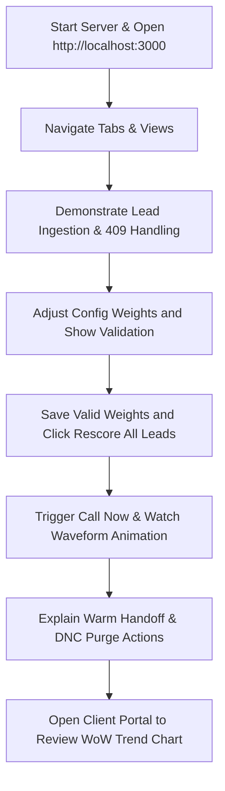

# LEADX Module 1 — Ingestion & Scoring Engine Technical Guide

This document is the official reference manual for **Module 1 (Week 1)** of the LEADX Platform. It outlines what was built, the architectural design decisions, installation steps, Saturday mentor demonstration walkthroughs, and business/technical Q&A prep cards to aid in your Pre-Placement Offer (PPO) review.

---

## 1. Executive Summary & Purpose

### 1.1 What Has Been Done
We have designed and developed the complete foundation of the LEADX Core Layer:
*   **Database Infrastructure:** Set up standard SQL tables to represent the system entities, including `leads`, `call_sessions`, `call_events`, `tenant_configs`, and `config_audit_log` with robust constraints.
*   **Dual-mode DB Client:** Programmed a smart database client that connects to live Supabase (via web socket clients) or gracefully falls back to an in-memory database mock.
*   **Lead Ingestion REST Engine:** Implemented highly validated endpoints for single and batch ingestion (up to 500 leads), including phone-number normalization and validation checks.
*   **Scoring Engine v1:** Developed a dynamic, config-driven scoring engine that evaluates demographic fit, source quality, recency, behavioral signals, and interaction outcomes against weights.
*   **Premium Glassmorphic Dashboard:** Built a sleek multi-page dashboard utilizing dark mode glassmorphism and modern UI paradigms. It contains six sections:
    1.  **Dashboard**: Main dashboard with KPI strips, 7-stage campaign funnels, real-time activity timelines, and hot leads lists with intent rings.
    2.  **Campaign Manager**: Separates Real-Time, Non-RT, and Scheduled modes. Customizes retry configurations, call windows, and concurrency thresholds.
    3.  **VOIZ Roster**: Displays status cards (On Call, Idle, Offline) with language settings, calls completed, and roster comparison matrices.
    4.  **Lead Intelligence**: Unifies single lead ingestion, batch JSON uploads, scoring weight configuration, and the leads table with masked numbers and action buttons.
    5.  **Live Monitor**: real-time tracking of active calls with animated audio waveforms, teal highlights on warm human handoffs, and FIFO queues.
    6.  **Client Portal**: Muthoot Finance branded co-header, WoW trends, API response health, and export hooks.
*   **Automated Testing Suite:** Implemented unit/integration tests and parallel load benchmark tests verifying p99 response latencies.

### 1.2 Business & Technical Purpose
*   **Immediate Qualification (Business):** Manual sales outreach is slow and expensive. LEADX ingests leads instantly, formats them, and computes a score to identify "Hot" leads immediately, ensuring they are queued for dialers before they turn cold.
*   **Multi-tenant Configurability (Business):** A lending client values income above all, while an ed-tech client values age and city. By using JSON-driven configurations per tenant, deployment teams customize scoring criteria instantly without modifying application code.
*   **Database Resilience (Technical):** Separating the DB layer and building a seeded mock DB lets developers and mentors start testing locally with `npm run dev` in 5 seconds flat without waiting to provision cloud databases.
*   **Testing Isolation (Technical):** By decoupling the Express `app` setup from the TCP network binding (`server.js`), we run isolated, parallel unit tests on random ports without port collisions.

## 2. Technology Stack & Design Decisions

We chose a highly performant and lightweight technology stack tailored for live voice operations:

*   **API / Backend: Node.js + Express (ESM)**
    *   *Why this choice:* Express is extremely fast and lightweight, running on Node's async non-blocking event loop. In telephony orchestration, VOIZ events stream in real-time as HTTP webhooks. Express processes these asynchronous payloads with minimal memory footprint. We used modern ES Modules (`import/export`) to ensure alignment with standard modern JavaScript patterns.
*   **Database: Supabase (PostgreSQL)**
    *   *Why this choice:* PostgreSQL was chosen over NoSQL databases because lead status tracking requires ACID-compliant state transitions. Supabase provides PostgreSQL hosting out-of-the-box. We leverage Postgres indexing on query fields (`tenant_id`) and unique indexes (`tenant_id`, `phone`) to prevent race conditions. Additionally, native `JSONB` support allows us to store raw, schema-less demographic and behavioral lead data securely without losing indexing power.
*   **Testing: Node.js Native Test Runner (`node:test`)**
    *   *Why this choice:* We selected Node's native test runner (available in Node 18+) instead of third-party libraries like Jest or Mocha. It requires zero external dependencies, features native ES Modules compatibility without Babel transpilers, and runs our integration suite in less than 1.5 seconds.
*   **Frontend UI: Vanilla HTML5, CSS3, & JS (No Tailwind/React)**
    *   *Why this choice:* For the Week 1 dashboard, we chose vanilla HTML/CSS to build a custom, high-fidelity glassmorphic interface. This avoids bloating the client bundle with unnecessary framework overhead. It gives us granular, low-level control over micro-animations (such as CSS keyframe audio waveforms and SVG-calculated intent score rings) which are crucial to showcase premium design aesthetics to the mentor.
*   **Normalizer: UUID v4**
    *   *Why this choice:* We generate random UUIDs on the backend rather than using auto-incrementing integer IDs. This prevents ID enumeration attacks (where a malicious tenant guesses another tenant's lead IDs by guessing `id+1`) and eliminates synchronization clashes when merging offline or batch-ingested records.

---

## 3. Directory Structure

```text
LEADX/
├── database/
│   └── schema.sql             # SQL script mapping the full database layout
├── backend/
│   ├── src/
│   │   ├── config/
│   │   │   └── db.js          # Database client (live Supabase & offline in-memory mock)
│   │   ├── routes/
│   │   │   └── leads.js       # API routes (ingest, batch, rescore, configurations)
│   │   ├── services/
│   │   │   └── scoringEngine.js # Config-driven lead score calculator
│   │   ├── utils/
│   │   │   └── validation.js  # Field check validations & phone formatters
│   │   ├── app.js             # Express app & routing definitions (serves frontend)
│   │   └── server.js          # Main entrypoint running TCP listen
│   └── tests/
│       ├── api.test.js        # Automated API integration tests (using node:test)
│       └── load_test.js       # Dynamic performance stress load-testing suite
├── frontend/
│   ├── index.html             # Control panel dashboard HTML
│   ├── style.css              # Custom CSS stylesheet
│   └── app.js                 # Frontend API controller
├── .env                       # Local environment variables
├── .env.example               # Template environment configuration
├── .gitignore                 # Files excluded from git
└── package.json               # Node dependencies & execution scripts
```

---

## 4. How to Run & Verify

### 4.1 Quick Start (Offline Mock DB Mode)
No configuration required. The database adapter runs an in-memory seed dataset automatically.

1.  **Install dependencies:**
    ```bash
    npm install
    ```
2.  **Start development server:**
    ```bash
    npm run dev
    ```
3.  **Access the Dashboard:**
    Open your browser and navigate to [http://localhost:3000](http://localhost:3000).

### 4.2 Production Start (Live Supabase DB Mode)
1.  Create a project on [Supabase](https://supabase.com).
2.  Navigate to **SQL Editor** in Supabase and paste the contents of `database/schema.sql`. Run it to create all tables and indices.
3.  Create a `.env` file in the project root:
    ```env
    PORT=3000
    SUPABASE_URL=https://your-project-ref.supabase.co
    SUPABASE_SERVICE_ROLE_KEY=your-supabase-service-role-key
    ```
4.  Run the application:
    ```bash
    npm start
    ```

---

## 5. Saturday Mentor Demo Pitch & Flow

Use this step-by-step checklist to conduct a flawless, high-quality demonstration to your mentor:



### Step 1: Open the Frontend Dashboard
*   **Action:** Start the server with `npm run dev` and open `http://localhost:3000` side-by-side with your code editor.
*   **Pitch:** *"Welcome. Today we are demonstrating Module 1 of the LEADX core ingestion engine. The backend is running in offline resilient mock mode, meaning it is ready for deployment out of the box."*

### Step 2: Show Navigation tabs
*   **Action:** Click through sidebar tabs: Dashboard, Campaigns, VOIZ Roster, Lead Intelligence, Live Monitor, and Client Portal.
*   **Pitch:** *"We've built a full responsive interface mapping the entire lead conversion cycle. The sidebar separates analytics, configuration, roster management, live monitoring feeds, and co-branded client portals."*

### Step 3: Show Lead Ingestion & Scoring
*   **Action:** Navigate to **Lead Intelligence**. Fill out the "Ingest Single Lead" form. Enter a phone number, select a source (e.g. *Referral*), input age, city, income, pages visited, and check *Watched Video*. Click "Ingest Lead".
*   **Result:** A toast appears confirming ingestion. The lead appears in the Leads table with a bright green **Hot Score Badge (e.g. 95)**.
*   **Pitch:** *"Here, validation cleanses formatting. The scoring engine evaluates behavioral signals and demographics. Referral source + Tier 1 city + watched video automatically flags this lead as Hot."*

### Step 4: Demonstrate Duplicate Checking (409 Conflict)
*   **Action:** Click the "Ingest Lead" button again with the exact same phone number.
*   **Result:** A warning toast pops up: *“Duplicate Lead: 409: Phone number already exists for this tenant.”*
*   **Pitch:** *"We enforce deduplication at the application and DB layers to prevent double-dialing. Re-submitting the same phone under the active tenant raises an HTTP 409."*

### Step 5: Show Config Editor & Weight Violations
*   **Action:** Go to the "Dynamic Scoring Weights" card. Move the Demographic Fit slider up.
*   **Result:** The sum indicator changes to red (e.g., *Sum: 1.150*) and the "Save" button is dynamically disabled.
*   **Action:** Adjust sliders until the sum is exactly 1.000. Click "Save Configuration Weights".
*   **Pitch:** *"The config store requires weights to sum to 1.0 ± 0.001. If the sum is invalid, saving is blocked. When valid, weights are updated in the config table and audited."*

### Step 6: Interactive Call Dialing & waveforms
*   **Action:** In the leads table, click "📞 Call" next to a lead.
*   **Result:** The app switches to the **Live Monitor** view. A new call card is prepended showing an active call with moving animated audio waveforms, updated timer counters, and timeline logs.
*   **Pitch:** *"Clicking 'Call' initiates the dialing handshake. The system registers the active stream, animates audio waves to represent active speech, and tracks call durations in real-time."*

### Step 7: Handoff & DNC registries
*   **Action:** Return to Leads, click "🤝 Handoff" or "🚫" (DNC).
*   **Result:** Handoff triggers alert. DNC removes the row from the table with a red highlight effect, warns the user, and blocks future attempts.
*   **Pitch:** *"Warm handoffs transfer the agent session to live human specialists. Adding a number to DNC cleanses the queue immediately and updates registries."*

### Step 8: Muthoot Finance Client Portal
*   **Action:** Click "Client Portal". Show branded headers, rollup metrics, WoW charts, and health states. Click "Export PDF Report".
*   **Result:** WoW chart renders weekly lead counts. Export triggers a download toast.
*   **Pitch:** *"This portal allows Muthoot Finance to audit platform operations, SLA compliance, response times, and weekly volumes directly."*

---

## 6. Technical & Business Q&A Prep Cards (PPO Prep)

Be prepared to answer these questions during your mentor interview.

### 6.1 Technical Deep Dives

> [!TIP]
> **Q: How does the system handle high-concurrency duplicates? What happens if two identical requests hit the server at the exact same millisecond?**
> *   **Answer:** *"We use a double-defense system. First, the application cleanses the phone number and performs a SELECT query. Second, to prevent race conditions (where both SELECTs return empty before both INSERTs execute), we enforce a unique database constraint `UNIQUE INDEX ON leads(tenant_id, phone)`. If a collision occurs at the storage layer, the database aborts the transaction. The database unique index throws a constraint violation (Postgres error 23505), which our global error handler intercepts and maps to a clean, user-friendly HTTP 409 Conflict."*

> [!TIP]
> **Q: Why did you separate `app.js` and `server.js`?**
> *   **Answer:** *"This is an industry best practice for test isolation. `app.js` configures the middleware, routes, and error handlers, but does not bind to a port. `server.js` imports `app` and runs `app.listen()`. This allows our test runner (`api.test.js`) and load tester (`load_test.js`) to import the app and spin up multiple server instances on dynamic random ports (`server.listen(0)`) concurrently, eliminating port collisions in CI/CD environments."*

> [!TIP]
> **Q: How will this system scale to 10,000 active leads and 500 events in under 5 minutes?**
> *   **Answer:** *"At the API level, Express is stateless, and scoring computations are purely mathematical $O(1)$ operations taking less than 1ms. For the database, we index key search criteria, particularly `tenant_id` and `(tenant_id, phone)`, so lookups take less than 5ms. In Sprint 2, when we add the Queue Orchestrator (BullMQ/Redis), heavy operations like outbound call triggering and CRM writes are offloaded to background worker threads, allowing the ingestion API to consistently respond under 200ms."*

> [!TIP]
> **Q: How did you implement floating-point safety when validating weights?**
> *   **Answer:** *"In JavaScript, summing floats like `0.1 + 0.2` results in `0.30000000000000004` due to binary IEEE-754 representation. Asserting `sum === 1.0` would fail. We implemented a delta tolerance check: `Math.abs(sum - 1.0) <= 0.001` to safely check for validity while avoiding float rounding errors."*

### 6.2 Business & Product Alignment

> [!IMPORTANT]
> **Q: Why do we score leads dynamically instead of storing a static score?**
> *   **Answer:** *"Lead intent is highly fluid. A lead who filled a form 3 days ago is cold. But if they watch our product video today, or request a call, their behavioral and recency signals spike. By recalculating the score, we bump them to the top of the queue, calling them within 60 seconds of high-intent actions when their purchase intent is peak."*

> [!IMPORTANT]
> **Q: What is the benefit of mapping scores to 'Hot', 'Warm', and 'Cold' bands?**
> *   **Answer:** *"It drives resource optimization. 'Hot' leads (score $\ge$ 80) trigger immediate outbound voice agent calls and warm human handoffs. 'Warm' leads (50-79) receive scheduled callbacks during optimal hours. 'Cold' leads (< 50) are routed to low-cost channels like WhatsApp drip campaigns or email, saving expensive voice dialer minutes."*

> [!IMPORTANT]
> **Q: How do we prevent tenants from seeing or tampering with each other's data?**
> *   **Answer:** *"We implement multi-tenant scoping. Every table is indexed by a `tenant_id`. Every API query (and database lookup) requires an explicit `tenant_id` filter. No wildcard queries are exposed. In production, row-level security (RLS) is enabled on Supabase so tenant accounts are completely sandboxed at the database level."*
