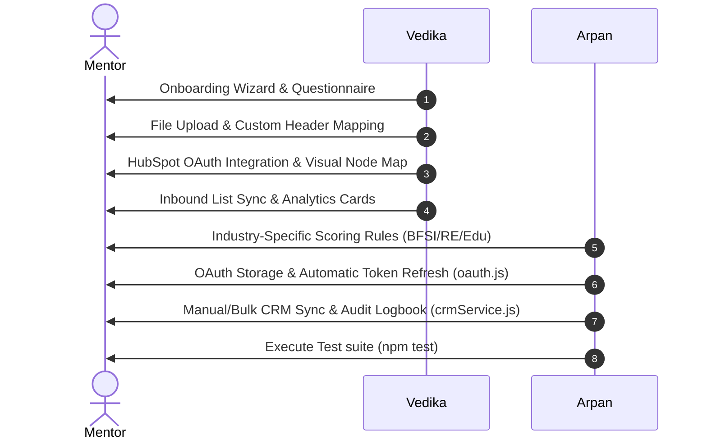

# LEADX Module 2 — Onboarding, Mapping, & CRM Integration Guide

This document is the authoritative technical reference for the Client Onboarding, Dynamic Column Mapping, DNC Shield, and CRM Integration Engine of the LEADX Platform.

---

## 1. Executive Summary & Capabilities

Module 2 extends the platform with enterprise onboarding capabilities and CRM adapters:

*   **Onboarding Questionnaire Wizard:** A step-by-step onboarding pipeline mapping campaign objectives, industry domains, and CRM destinations.
*   **Self-Serve Spreadsheet Parser:** Parses raw CSV lead sheets in the browser, allowing clients to map custom headers dynamically to internal schema fields.
*   **DNC Compliance Registry Shield:** Integrates a platform-level screening step checking numbers against national Do Not Call registries before dial sessions.
*   **HubSpot OAuth 2.0 & Auto-Refresh:** Supports token-based HubSpot authorization, storing credentials in a Postgres JSONB field, and refreshing expired access tokens server-to-server automatically.
*   **LeadSquared CRM Integration:** Standard API-key connector supporting custom payloads.
*   **Central logbook & Slack Webhook Alerts:** Structured SQL logs (`audit_trail`) tracking sync actions and dispatching instant notices to operations channels.
*   **Dynamic Lead Analytics:** Computes average intent score, hot lead volume, and qualification rates.
*   **Dynamic Industry-Specific Scoring:** Applies customized scoring logic for **BFSI**, **Real Estate**, and **Education** domains.

---

## 2. Platform User & Functionality Guide

### 2.1 Onboarding Wizard
1.  **Questionnaire (Step 1):** Select the industry template (**BFSI**, **Real Estate**, or **Education**).
2.  **Upload (Step 2):** Upload lead contact sheets. Quick sample templates are provided for testing.
3.  **Dynamic Column Mapping (Step 3):** Dropdowns map CSV headers to schema fields (`phone`, `name`, `email`, `age`, `income`, `city`).
4.  **Integration Setup (Step 4):** Toggle DNC validation, select destination CRM (**HubSpot** or **LeadSquared**), and finalize ingestion.

### 2.2 CRM Sync Control Center
*   **Integration Node Map:** Interactive status node that glows green when CRM handshake is verified.
*   **Manual & Bulk Sync Queue:** Push qualified contacts in bulk or individually.
*   **CRM Audit Logs:** Real-time log table showing synchronization timestamps, payloads, and vendor IDs.

---

## 3. CRM Integration Reference

LEADX uses the **Adapter Pattern** to abstract HubSpot and LeadSquared integrations.

### 3.1 HubSpot Adapter
*   **Authentication:** OAuth 2.0 (preferred) or Private App Access Token (`HUBSPOT_API_KEY`).
*   **Token Refresh:** If the current time exceeds `expires_at`, the server dispatches a request to `https://api.hubapi.com/oauth/v1/token` to retrieve a new access token, updates the database, and completes the sync.
*   **API Endpoint:** `POST https://api.hubapi.com/crm/v3/objects/contacts` (inserts or patches by contact ID or email).
*   **Payload Format:**
    ```json
    {
      "properties": {
        "firstname": "Jane Doe",
        "phone": "+919999988888",
        "email": "jane.doe@gmail.com",
        "leadx_score": "85",
        "leadx_status": "hot_escalated"
      }
    }
    ```

### 3.2 LeadSquared Adapter
*   **Authentication:** Access Key (`LEADSQUARED_API_KEY`).
*   **API Endpoint:** `POST https://api.leadsquared.com/v1/LeadManagement.svc/Lead.Create`
*   **Payload Format:**
    ```json
    [
      { "Attribute": "FirstName", "Value": lead.name },
      { "Attribute": "Phone", "Value": lead.phone },
      { "Attribute": "EmailAddress", "Value": lead.email },
      { "Attribute": "mx_LeadX_Score", "Value": String(lead.score) },
      { "Attribute": "mx_LeadX_Status", "Value": lead.status }
    ]
    ```

### 3.3 CRM Lists Inbound Pulling
*   Users can sync lists directly into the LeadX ingestion pipeline. Selecting a CRM segment triggers a fetch query, passing data to `/leads/batch` for processing.

### 3.4 Slack Failure Alerting
*   If a CRM sync fails, the incident is logged in the `audit_trail` table as a `crm_sync_failure` event, and an instant alert is pushed to the operations Slack channel with failure reasons.

---

## 4. Hybrid AI Engine Architecture: Heuristics vs. LLMs

```
Incoming Lead Data / Call Stream
  │
  ├──► Heuristics (Local Server Math - 0 Token Usage)
  │     ├── phone format parsing & DNC screening
  │     ├── multi-factor weighted scoring
  │     └── industry-specific demographic rules
  │
  └──► Large Language Models (LLM API - Targeted Token Usage)
        ├── outbound conversational voice (VOIZ)
        ├── intent & objection classification
        └── call transcript summarization
```

### 4.1 Scoring Rules by Industry Template
*   **BFSI Template:** Evaluates `monthly_income` ($\ge 85\text{k}$: $100$, $\ge 45\text{k}$: $80$, else $50$), `credit_score` ($\ge 750$: $100$, $\ge 650$: $75$, else $40$), and `loan_amount` ($100\text{k} - 1.5\text{M}$: $100$, else $70$).
*   **Real Estate Template:** Evaluates `budget` ($\ge 5\text{M}$: $100$, $\ge 2.5\text{M}$: $80$, else $50$), `property_type` containing "BHK" ($100$, else $70$), and preferred cities ($100$, else $70$).
*   **Education Template:** Matches `course_interest` ($100$) and academic qualifications ($100$, else $70$).
*   **Fallback Default:** Averages Age (21-35: 100, 18-45: 70), City (Tier 1: 100, Tier 2: 70), and Income ($\ge 500\text{k}$: 100, $\ge 300\text{k}$: 75).

---

## 5. Saturday Mentor Demo - Shared Presentation Script



### 🎙️ Part 1: Vedika (Frontend Flow & Client Journey) — 5 Minutes
1.  **Onboarding Questionnaire:** Open Onboarding tab. Select BFSI industry.
    > *"Good morning. I'll cover the onboarding and setup. New clients use our onboarding questionnaire wizard. Selecting an industry category like BFSI dynamically loads scoring rules and templates."*
2.  **CSV Mapping:** Click load BFSI sample data. Map columns.
    > *"The columns mapper parses raw header fields and maps them to our schema. Clients can map custom headers dynamically, which decouples our database layer from client formatting variations."*
3.  **HubSpot OAuth:** Open CRM Integration. Click Connect HubSpot.
    > *"We support HubSpot OAuth 2.0. Clicking authorize opens our sandbox consent screen. Once approved, access and refresh tokens are saved in our database config, making the HubSpot node glow green."*
4.  **Inbound List Sync:** Import leads from the CRM Contacts dropdown.
    > *"We also support importing lists. Once contacts are fetched, normalized, and scored, the Dynamic Lead Analytics cards immediately recalculate averages."*

### 🎙️ Part 2: Arpan (Backend Infrastructure & Integration) — 5 Minutes
1.  **Industry Scoring & DNC:** Show scoring logic in **[scoringEngine.js](../backend/src/services/scoringEngine.js)** and DNC shield in **[leads.js](../backend/src/routes/leads.js)**.
    > *"On the backend, leads go through customized industry scoring filters. We also check the numbers against a DNC registry shield. If blocked, the lead status updates, the block is logged in PostgreSQL, and an operations alert is sent to Slack."*
2.  **OAuth & Auto-Refresh:** Show **[oauth.js](../backend/src/routes/oauth.js)** and **[crmService.js](../backend/src/services/crmService.js)**.
    > *"Tokens are stored in a Postgres JSONB field in `tenant_configs`. If an access token is expired, our CRM sync adapter executes `refreshHubSpotToken` to refresh credentials server-to-server and update our database before executing pushes."*
3.  **Bulk Sync & Audits:** Push leads in the Manual Sync drawer. Show the CRM Logs.
    > *"Clicking Bulk Sync sends IDs to `/leads/batch-sync-crm`. We process calls in parallel using our CRM adapters, log success/failure results in `audit_trail`, and push notifications to Slack."*
4.  **Test Run:** Execute `npm test` live.
    > *"We validate this entire pipeline using our native test suite, executing 16 assertion blocks in under 2 seconds. The tests pass successfully, confirming system stability."*

---

## 6. Saturday Technical & Business Q&A Prep

> [!TIP]
> **Q: How does OAuth 2.0 token refresh handle expired sessions?**
> *   **Answer:** *"Before executing CRM pushes, the HubSpot adapter checks the current timestamp against the `expires_at` database value. If expired, it calls `refreshHubSpotToken()` to perform a server-to-server POST exchange using the refresh token, updates `tenant_configs`, and completes the sync."*

> [!TIP]
> **Q: How do we prevent CRM synchronization failures from breaking ingestion?**
> *   **Answer:** *"CRM syncs are decoupled from the core ingestion endpoints. If a sync fails, the error is caught, stored as a `crm_sync_failure` audit log event, and reported via a Slack webhook. This ensures that network failures on HubSpot's side do not block dialer operations or database transactions."*

---

## 7. Sandbox Verification Steps

To shift from offline mock mode to live databases:
1.  **Postgres Migrations:** Run **[schema.sql](../database/schema.sql)** inside your Supabase project SQL Editor.
2.  **Environment Settings:** Add database keys, HubSpot client credentials, and Slack webhooks to **[.env](../.env)**.
3.  **Expose Webhooks:** Use `ngrok http 3000` to expose the Express server and map webhook endpoints for telephony events.

---

## 8. Platform Functionality Verification Guide (How to Use & Test)

Here is a step-by-step guide to verify each specific functionality implemented in the system. Make sure the development server is running (`npm run dev`) and access `http://localhost:3000` in your web browser.

### 8.1 Onboarding & Column Mapping
*   **Step 1:** Click on the **Onboarding** tab in the sidebar.
*   **Step 2:** Choose the **BFSI** template in the industry selector, enter campaign criteria, and click **Proceed to Data Upload**.
*   **Step 3:** Under the file uploader section, click **Load BFSI CSV Sample**. The system parses the headers and moves you to the column mapper page.
*   **Step 4:** Observe that custom columns are mapped to schema keys. Choose mappings in the dropdowns and verify that the live preview table columns update.
*   **Step 5:** Toggle **Enable Platform DNC Check**, select **HubSpot** in CRM destination, and click **Finalize & Ingest**. Check the leads list below to see the ingested leads.

### 8.2 Phone Normalization & Lead Ingestion
*   **Step 1:** Open the **Lead Intelligence** tab in the sidebar.
*   **Step 2:** Under **Single Lead Ingest**, fill in name, email, referral source, monthly income, and a phone number containing formatting marks (e.g. `+91 (9988) 77-66-55`).
*   **Step 3:** Click **Ingest Lead**. A success toast will appear.
*   **Step 4:** Locate the lead in the table and verify that the phone number is stored in standard E.164 format: `+919988776655`.

### 8.3 Weight Configurations & Dynamic Rescoring
*   **Step 1:** Under the **Lead Intelligence** page, adjust the 5 weights sliders (Demographic Fit, Source Quality, Recency, Behavioral Signals, Prior Outcomes).
*   **Step 2:** Try to adjust them so they sum to more than `1.000` (e.g. `1.15`). Verify that the indicator turns red and the **Save Scoring Weights** button is disabled.
*   **Step 3:** Rebalance the sliders to sum to exactly `1.00` and click **Save Scoring Weights**.
*   **Step 4:** Click **Rescore All Leads**. Verify that the SVG intent rings update their scores and offsets on all rows.

### 8.4 HubSpot OAuth 2.0 Integration
*   **Step 1:** Go to the **CRM Integration** tab in the sidebar.
*   **Step 2:** Under HubSpot panel, click **Connect HubSpot CRM**.
*   **Step 3:** A mock consent window will pop up. Click **Approve Connection**.
*   **Step 4:** The pop-up closes automatically, a success toast pops up on the main page, the HubSpot node on the interactive connection graph glows green, and the status changes to `CONNECTED`.

### 8.5 CRM Synchronizations (Manual & Bulk Pushes)
*   **Step 1:** Click on the **CRM Integration** tab.
*   **Step 2:** Open the **Manual Push & Bulk Sync Queue** drawer at the bottom.
*   **Step 3:** Check the boxes next to multiple qualified leads. Choose **HubSpot** in the selector, and click **Bulk Sync**.
*   **Step 4:** Review the **CRM Logs** table below. Verify that success sync outcomes are logged with active timestamps and external mock IDs.

### 8.6 Slack Operations Webhook Alerts
*   **Step 1:** In mock mode (no `SLACK_WEBHOOK_URL` in `.env`), perform a hot lead ingestion ($\ge 80$) or save a new weight configuration.
*   **Step 2:** Inspect your node server console (the shell running `npm run dev`).
*   **Step 3:** Verify that mock Slack messages are logged in the stdout feed:
    `[Slack Notification Mock] Channel #notifications: [Ingestion Alert] HOT Lead Ingested...`
*   *(If a live webhook is configured, the messages will be delivered directly to the designated channel).*

### 8.7 VOIZ Call & Webhook Event Simulator
*   **Step 1:** Open the **Lead Intelligence** feed.
*   **Step 2:** Click the **Call** button next to a lead row.
*   **Step 3:** Switch to the **Live Monitor** tab in the sidebar.
*   **Step 4:** Note that the lead is now appearing in the active call monitors with an active call duration clock and an animated speech waveform.
*   **Step 5:** Review the **VOIZ Call Event Stream Logs** in the panel. Verify that webhook events like `call_started`, `objection_raised`, `qualification_intent`, and `call_ended` are arriving in real time.
