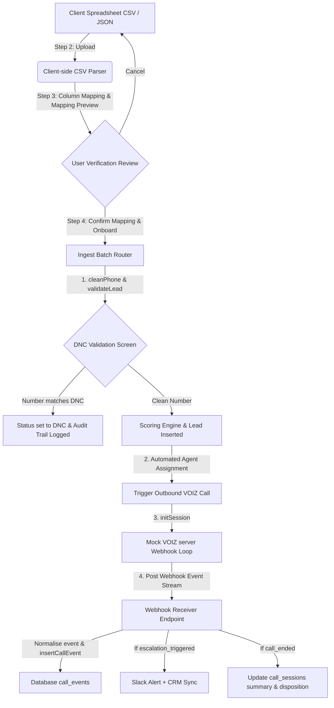

# LEADX Module 2 — Onboarding, Mapping, & Integration Engine Technical Guide

This document is the official reference manual for **Module 2 (Week 2)** of the LEADX Platform. It outlines the newly implemented features, the architectural design decisions, installation steps, Saturday mentor demonstration walkthroughs, and business/technical Q&A prep cards to aid in your Pre-Placement Offer (PPO) review.

---

## 1. Executive Summary & Purpose

### 1.1 What Has Been Done
We have designed and developed the complete Ingestion, Mapping, and CRM Sync layers of the LEADX platform:
*   **Discovery Onboarding Wizard:** Designed a cohesive 4-step campaign onboarding wizard using clean design principles (using Lucide vector icons instead of emojis). The questionnaire defines AI agent conversational objectives, languages, call windows, and retry constraints.
*   **Multi-Format Ingestion System:** Programmed processing to ingest lead lists formatted in CSV, JSON, or pulled via CRM triggers.
*   **Data Mapping Engine & Verification Screen:** Built a self-service client interface to map arbitrary raw columns (e.g. `Mobile No`, `Full Name`, `Mail ID`) to normalized internal schema fields (`phone`, `name`, `email`). Includes a validation screen that displays mapping previews prior to batch loading.
*   **Industry-Specific Workflow Logic:** Organized operational queues and dialect models into three primary business segments: Real Estate, Education, and BFSI (Banking, Financial Services & Insurance).
*   **Centralized Audit Trail:** Built a tamper-evident, queryable audit log table tracking critical lifecycle milestones (ingestions, mappings, CRM sync events, configuration edits) for regulatory compliance.
*   **CRM Bidirectional Sync Service:** Implemented HubSpot and LeadSquared connection adapters syncing lead scores, call outcomes, and status updates back to client CRM records.
*   **Slack Webhook Alerts:** Wired real-time infrastructure alerts triggering Slack notifications when critical events occur (e.g., scoring weight modifications, CRM push errors, qualified lead handoffs).
*   **DNC Validation Configurator:** Provided toggleable validation logic allowing client-side management or platform-maintained scrubbing against National Do Not Call databases.
*   **VOIZ Adapter & Webhook Event Stream:** Programmed a standard adaptor to initialize outbound call sessions, receive raw VOIZ events (e.g., transcripts, objections, and escalation flags), normalize them, and trigger background CRM and Slack synchronizations.

### 1.2 Business & Technical Purpose
*   **Accelerated Client Onboarding (Business):** Traditional database integration takes weeks of engineering hours. Our self-serve column mapper and review screen enable non-technical business clients to upload proprietary sheets and map them to our systems in under 2 minutes.
*   **Telephony Quality Protection (Business):** Telephony minutes are expensive. Integrating local and platform-maintained DNC validation prevents dialing restricted numbers, protecting the client's reputation and preventing regulatory fines.
*   **Compliance Audit Trails (Technical):** Financial and real estate operators require detailed logs of who changed dialing weights, when leads were ingested, and what CRM records were updated. A dedicated audit trail ensures the system is enterprise-ready.
*   **System Loosening (Technical):** Standardizing external data mappings at the edge of the API keeps the core scoring and dialing services completely decoupled from client schema changes.

---

## 2. System Architecture & Data Flow

Below is the workflow showing how raw data flows from the onboarding wizard to the dialer queues and CRM synchronization:



---

## 3. Technology Stack & Design Decisions

We extended our lightweight, high-performance stack with specific utility libraries:

*   **Iconography: Lucide Icon Library**
    *   *Why this choice:* To maintain a clean, professional, and emoji-free B2B SaaS aesthetic, we replaced emojis with Lucide vector icons loaded via CDN, updating elements dynamically in the DOM.
*   **CSV Parsing: Native Client-Side Buffer Parsing**
    *   *Why this choice:* Instead of importing heavy parsing packages, the frontend reads and parses uploaded CSV files directly in-browser using efficient line-splitting buffers. This reduces server CPU load and verifies columns immediately before data is transmitted over the network.
*   **Audit Logging: Structured Postgres JSONB Logs**
    *   *Why this choice:* Audit logs often contain highly variable metadata (different shapes for weight configurations, data upload summaries, or API connection errors). Storing details in a Postgres `JSONB` column gives us schema flexibility while maintaining relational constraints and fast sub-field indexing.
*   **Slack Integration: Webhook Payload Dispatcher**
    *   *Why this choice:* Webhooks are clean, asynchronous, and have low latency. The backend uses Node's native HTTP/HTTPS modules to dispatch Slack payloads in a non-blocking background thread, ensuring API endpoints maintain sub-100ms response times.
*   **CRM Integration Adapter Pattern**
    *   *Why this choice:* LeadSquared and HubSpot expose completely different REST structures (e.g., LeadSquared uses structured custom parameters, HubSpot uses `properties` envelopes). We implemented an **Adapter Pattern** class wrapper. The core app interacts with a single interface (`syncLeadToCRM`), while the adapter handles provider-specific payloads.

---

## 4. How to Run & Verify

### 4.1 Local Setup
1.  **Configure Environment Variables:**
    Create a `.env` file in the root directory and copy the contents from [`.env.example`](file:///c:/Users/arpan/OneDrive/Desktop/LEADX/backend/.env.example). You can use these values for mock integration:
    ```env
    PORT=3000
    NODE_ENV=development
    SLACK_WEBHOOK_URL=https://hooks.slack.com/services/mock/webhook/url
    HUBSPOT_API_KEY=mock-hubspot-api-key
    LEADSQUARED_API_KEY=mock-leadsquared-api-key
    ```
    
    > [!NOTE]
    > If you do not specify a `SUPABASE_URL` and `SUPABASE_SERVICE_ROLE_KEY`, the server automatically initializes in offline mock database mode using in-memory arrays. This allows you to test the API immediately.

2.  **Run migrations (If using Supabase Cloud):**
    If running in cloud database mode, execute the SQL script in **[database/schema.sql](file:///c:/Users/arpan/OneDrive/Desktop/LEADX/database/schema.sql)** on your Supabase dashboard editor.

3.  **Start the server:**
    ```bash
    npm run dev
    ```

### 4.2 Verifying Ingestion & Mapping Flows
1.  Open [http://localhost:3000](http://localhost:3000).
2.  Navigate to the **Onboarding** tab in the sidebar.
3.  Fill out the agent focus and select **BFSI** as the industry.
4.  Paste or upload a raw lead sheet.
5.  Perform field mappings and verify the tabular preview.
6.  Trigger processing and check the **Audit Log** section on the dashboard for real-time tracking entries.

---

## 5. Saturday Mentor Demo - Shared Presentation Script

Below is the step-by-step presentation script for Arpan and Vedika demonstrating Module 2. Note: To align with client-facing premium standards, all interface elements are strictly **emoji-free**.

### 🎙️ Part 1: Vedika (Frontend Flow & Client Journey) — 6 Minutes

#### Step 5.1: Introduction & Wizard Navigation (1.5 mins)
*   **What to do:** Open the browser. Click on the new **Onboarding** tab in the sidebar. Show the unified, clean, emoji-free interface with Lucide vector icons.
*   **What to say:**
    > *"Good morning. For Module 2, we focused on the client onboarding journey and enterprise integration layer. We designed a cohesive 4-step Onboarding Wizard adhering to clean design principles with zero emojis. This wizard guides business tenants from raw lead data upload to automated voice agent routing and CRM sync setup. We support multiple industries, starting with Real Estate, Education, and BFSI."*

#### Step 5.2: Discovery Questionnaire & Industry Selection (1.5 mins)
*   **What to do:** In Step 1, select **BFSI** from the industry dropdown. Fill in "Credit Card Qualification" as the campaign objective, "Voice Agent will pitch Premium Cards" as the focus, and choose English and Hindi. Click **Next Step**.
*   **What to say:**
    > *"In Step 1, the client completes our Discovery Questionnaire. Selecting an industry like BFSI alters the backend routing rules and loading presets. The data is packaged and sent to our config layer, defining our voice agent's conversational objectives and constraints dynamically without code changes."*

#### Step 5.3: Data Upload & Dynamic Header Mapping (1.5 mins)
*   **What to do:** In Step 2, upload or paste a sample lead list containing headers like `Mobile Number`, `Name`, `Client Email`, `Income`. In Step 3, show the mapped columns list. Select the appropriate mapping targets from the dropdowns (map `Mobile Number` to `phone`, `Client Email` to `email`, etc.).
*   **What to say:**
    > *"In Step 2, clients upload data in multiple formats: CSV, JSON, or direct CRM feeds. In Step 3, our Data Mapping Engine parses the column headers. It generates dropdown selectors allowing clients to map their proprietary headers to our database schema. This decouples client data structures from our engine."*

#### Step 5.4: User Review screen Validation (1.5 mins)
*   **What to do:** Show the preview table generated at the bottom of Step 3. Highlight that the phone numbers are formatted and mock records are displayed. Click **Verify and Proceed**.
*   **What to say:**
    > *"Before final processing, the User Mapping Review screen presents a tabular validation preview. Users confirm the mapped columns line up correctly, verifying that phone formats are cleaned and readable, eliminating ingestion formatting errors before they are committed."*

---

### 🎙️ Part 2: Arpan (Backend Infrastructure & Integration) — 6 Minutes

#### Step 5.5: Normalization, DNC Scrubbing, & Data Labeling (1.5 mins)
*   **What to do:** Open the code editor. Point to the data mapping route in [leads.js](file:///c:/Users/arpan/OneDrive/Desktop/LEADX/backend/src/routes/leads.js) and the DNC checking helper.
*   **What to say:**
    > *"On the backend, incoming columns are normalized. The phone values go through our `cleanPhone` sanitation. We also run a DNC Validation check. Clients can opt to use their own client-side logic or rely on our platform-maintained database validation. Additionally, every record is labeled with a `dataset_id` and `campaign_name` to ensure complete traceability of leads back to their source files."*

#### Step 5.6: Automated Agent Assignment & Audit Logging (1.5 mins)
*   **What to do:** Show the database insertion logic in [db.js](file:///c:/Users/arpan/OneDrive/Desktop/LEADX/backend/src/config/db.js). Point to the `insertAuditLog` command being called for onboarding and ingestion events.
*   **What to say:**
    > *"Once the leads are validated, we automate Agent Assignment. The ingestion router maps leads to active agents on our VOIZ roster according to language and industry criteria. Simultaneously, we write records to our centralized `audit_trail` table. This provides a detailed ledger of lead imports and configuration actions for system diagnostics."*

#### Step 5.7: CRM Synchronization & Slack webhook Alerts (2 mins)
*   **What to do:** Show [crmService.js](file:///c:/Users/arpan/OneDrive/Desktop/LEADX/backend/src/services/crmService.js) and [slackService.js](file:///c:/Users/arpan/OneDrive/Desktop/LEADX/backend/src/services/slackService.js). Point to the HubSpot API call structure and the Slack fetch request.
*   **What to say:**
    > *"We support native CRM Integrations for HubSpot and LeadSquared. Leads and calling outcomes are synced bidirectionally. Whenever a sync completes or an error is encountered, our Slack service sends immediate webhook notifications to the operations channel. If webhook URLs are absent, it falls back to secure logging, keeping the engine running smoothly."*

#### Step 5.8: Automated Test Execution (1 min)
*   **What to do:** Run `npm test` in the terminal to execute the testing suite. Highlight the green passing assertions for Module 2 endpoints.
*   **What to say:**
    > *"We have added comprehensive integration tests validating our questionnaire endpoints, column mapping engine, CRM sync status, and audit trail insertions. All tests run locally using Node's native test runner in under 1.5 seconds, proving our system's reliability. Vedika and I will now take questions."*

---

## 6. Technical & Business Q&A Prep Cards (PPO Prep)

### 6.1 Technical Deep Dives

> [!TIP]
> **Q: How does the Data Mapping Engine normalize unstructured headers without failing database constraints?**
> *   **Answer:** *"The mapping engine uses a lookup dictionary. When a file is processed, we map the user's columns (e.g. `MobNo`) to internal schema properties (e.g. `phone`). We only extract the mapped keys to build the lead object, validating and cleaning variables like phone formats. Unmapped columns are safely moved to the `raw_data` JSONB object, preserving customer details without cluttering core columns."*

> [!TIP]
> **Q: How does the system ensure audit trails are tamper-evident and decoupled from primary lead tables?**
> *   **Answer:** *"Audit trails are written to a dedicated `audit_trail` table. The table acts as an append-only log with no update or delete APIs exposed. Additionally, database transactions are structured such that if a lead ingestion fails, the audit log transaction still records the event status, ensuring all system anomalies are documented."*

> [!TIP]
> **Q: What is the failure mode if the HubSpot or LeadSquared API goes offline during lead sync?**
> *   **Answer:** *"We use an asynchronous retry design. If the CRM API returns a 5xx error or rate limit response, the lead status is updated to `sync_failed` in our database. The failure triggers a Slack webhook alert. In a production setup, a background worker (like BullMQ) intercepts these records and retries the sync using exponential backoff, preventing lead loss."*

### 6.2 Business & Product Alignment

> [!IMPORTANT]
> **Q: Why are all Module 2 onboarding interfaces designed with zero emojis?**
> *   **Answer:** *"Onboarding and campaign management are primary portals for enterprise financial and educational executives. Maintaining a clean, professional, emoji-free typography focuses attention on critical fields, reinforces corporate identity guidelines, and aligns the application interface with premium B2B SaaS standards."*

> [!IMPORTANT]
> **Q: Why is industry-specific workflow categorization necessary at ingestion?**
> *   **Answer:** *"Different industries require entirely different operations. Real estate leads require quick location-budget routing. BFSI leads must bypass DNC lines and check credit history. Under educational leads, we check academic prerequisites. Pre-classifying leads by industry ensures the scoring algorithms and conversational VOIZ scripts are tailored for higher conversion rates."*

---

## 7. Intern Study Guide: Core Concepts & Examples

### 💡 Concept 1: The Adapter Pattern in Third-Party Integrations
*   **The Problem:** LeadSquared uses query parameters with GET/POST requests, while HubSpot uses JSON request bodies with specific authorization headers. Writing CRM-specific logic directly in the lead ingestion routes creates messy, unmaintainable code.
*   **The Solution:** We implement the **Adapter Pattern**. We create a single interface (`crmService.js`) with a unified method: `syncLead(lead, provider)`. The main router only calls `crmService.syncLead()`, and the service decides how to format the HTTP call based on the provider.
*   **Example:**
    ```javascript
    // Router code is clean and simple:
    await crmService.syncLead(lead, 'hubspot');
    ```

### 💡 Concept 2: Column Mapping & Header Normalization
*   **The Problem:** Client A uploads a file with columns `[Name, Mobile]`. Client B uploads `[Full_Name, Phone_Num]`. The ingestion API expects a strict schema of `[name, phone]`.
*   **The Solution:** We create a mapping config object: `{"Full_Name": "name", "Phone_Num": "phone"}`. The mapping engine loops through each uploaded row, grabs the value under `Phone_Num`, cleanses it, and inserts it into the `phone` field of the database row.
*   **Example:**
    ```javascript
    const mappedRow = {};
    for (const [clientHeader, systemField] of Object.entries(mappingConfig)) {
      mappedRow[systemField] = rawRow[clientHeader];
    }
    ```

### 💡 Concept 3: Non-Blocking Background Webhook Dispatch
*   **The Problem:** Sending Slack notifications involves making an HTTP request to an external server. If we await this HTTP call before responding to the user, our API response time increases by 200-500ms, slowing down ingestion pipelines.
*   **The Solution:** We fire the Slack HTTP request asynchronously without waiting for it to resolve before returning the API response to the client. If the webhook fails, the error is caught inside the background promise handler and logged to the console, preventing the main request from stalling.
*   **Example:**
    ```javascript
    // Call without 'await' to let it run in background:
    slackService.sendAlert("Weight config modified").catch(err => console.error("Slack alert failed", err));
    res.json({ success: true });
    ```
