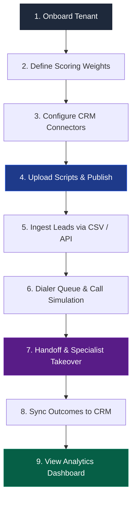

# LEADX Platform — End-to-End User & Operation Guide

Welcome to the **LEADX Platform User Guide**. This document serves as the master checklist and walkthrough for administrators, sales managers, operations specialists, and junior engineers to utilize the entire LEADX platform from initial setup to final conversion analytics.

---

## 🧭 System Workflow Map

---

## 🗂️ Platform Walkthrough Steps

### 1. Onboarding & Tenant Settings
*   **Action:** Open the **Client Onboarding Questionnaire** tab in the sidebar.
*   **How to Use:**
    1. Select the industry sector (e.g., **BFSI**, **Real Estate**, or **Education**).
    2. Input the business details, maximum concurrency limits (default: 5 lines), and localized timezone configs.
    3. Click **Initialize Client Profile** to generate a unique `tenant_id`.
*   **Next Steps:** Proceed to customize lead scoring weights. If you want to know about column schemas and sector templates, refer to [Module 2 Onboarding & Column Mapper Guide](file:///c:/Users/arpan/OneDrive/Desktop/LEADX/docs/module2_documentation.md).

---

### 2. Custom Lead Scoring Setup
*   **Action:** Go to the **Scoring Configurations** panel.
*   **How to Use:**
    1. Adjust the sliders representing the five qualification parameters: Demographic Fit, Source Quality, Recency, Behavioral Signals, and Prior Interaction.
    2. Ensure the sum of all weight parameters equals exactly `1.00` (the indicator will glow green).
    3. Click **Save Configurations** to apply these weights dynamically.
*   **Next Steps:** If you want to understand safe floating-point calculations or how multi-factor scoring handles records, refer to [Module 1 Ingestion & Scoring Engine Guide](file:///c:/Users/arpan/OneDrive/Desktop/LEADX/docs/module1_documentation.md).

---

### 3. Connecting External CRMs (OAuth & API Keys)
*   **Action:** Go to the **CRM Sync & Integrations** panel.
*   **How to Use:**
    *   **HubSpot:** Click **Connect HubSpot CRM**. Authorize via the mock consent popup window to automatically secure and refresh OAuth access tokens.
    *   **Salesforce:** Toggle Salesforce integration, enter Consumer Credentials, and click **Test Connection** to trigger an OAuth Client Credentials token swap.
    *   **LeadSquared:** Enter your API keys and the shared secret for HMAC signature verification.
*   **Next Steps:** If you want to know how the CRM adapters handle credentials exceptions, refresh cycles, or webhooks, refer to [Module 4 CRM Connectors Guide](file:///c:/Users/arpan/OneDrive/Desktop/LEADX/docs/module4_documentation.md) and the [CRM Sync Connector Setup Guide](file:///c:/Users/arpan/OneDrive/Desktop/LEADX/docs/crm-connector-setup.md).

---

### 4. Interactive Script Authoring
*   **Action:** Navigate to the **Script Editor & Graph Manager** page.
*   **How to Use:**
    1. Click **Load Ed-Tech Admissions** to populate a validated admissions JSON template, or write a custom JSON script from scratch.
    2. Define expected intents and directed graph routing branches.
    3. Set up escalation triggers like phrase matches (e.g., "representative"), low sentiment (e.g., `< 0.3`), or call duration limits.
    4. Click **Validate Schema** followed by **Save & Publish** to activate the script.
*   **Next Steps:** If you want to know how script nodes are parsed or how webhook events trigger supervisor notifications, refer to [Module 5 Script Authoring Guide](file:///c:/Users/arpan/OneDrive/Desktop/LEADX/docs/module5_documentation.md) and [Module 8 Ed-Tech Admissions Guide](file:///c:/Users/arpan/OneDrive/Desktop/LEADX/docs/module8_documentation.md).

---

### 5. Ingesting Leads (Batch & API)
*   **Action:** Locate the **Lead Ingestion Drawer** on the main dashboard.
*   **How to Use:**
    *   **CSV Batch Upload:** Click **Load CSV Sample**, map headers (e.g., mapping column `Mobile` to the system `phone` key), and click **Finalize Ingestion**.
    *   **Single Ingestion:** Enter the name, email, and phone number (e.g. `+9198765XXXXX`). The dialer automatically E.164-normalizes the number.
*   **Next Steps:** If you want to know how API endpoints are structured, refer to the [API Contracts Reference Guide](file:///c:/Users/arpan/OneDrive/Desktop/LEADX/docs/api-contracts.md).

---

### 6. Dialer Queues & Call Simulations
*   **Action:** Check the **Live Queue Monitor** widget.
*   **How to Use:**
    1. Observe the background worker polling leads and sorting them by score descending.
    2. Click **Call** on any lead card to start a voice call simulation.
    3. The Telephony Simulator will output transcription steps and active intents in real time.
    4. Screen numbers containing `0000` or `403` to verify DNC block actions.
*   **Next Steps:** If you want to know how exponential backoff or calling hours (IST timezone) are computed, refer to [Module 3 Call Orchestrator Guide](file:///c:/Users/arpan/OneDrive/Desktop/LEADX/docs/module3_documentation.md).

---

### 7. Handoff & Specialist Takeover
*   **Action:** Watch the top of the screen during simulated calls.
*   **How to Use:**
    1. If a caller says *"speak to agent"* or exhibits low sentiment, a flashing red **ACTIVE ESCALATION DETECTED** banner appears.
    2. Click **View Brief** on the banner to open the context card.
    3. Review the AI Call Summary, Key Phrases, Objections list, and recommended specialist response.
    4. Print the card via **Print Brief** or click **Resolve Handoff** once the specialist has taken over.
*   **Next Steps:** If you want to know how objections logic and recommended actions are generated, refer to [Module 6 Handoffs & Briefs Guide](file:///c:/Users/arpan/OneDrive/Desktop/LEADX/docs/module6_documentation.md).

---

### 8. Analytics & Optimization
*   **Action:** Navigate to the **Analytics & Performance** page.
*   **How to Use:**
    1. Review the line chart tracking Connect Rate Trend (Last 7 Days).
    2. Analyze the doughnut chart showing call outcome distributions (e.g., Converted, Interested, Refused, Callback).
    3. Verify the bar chart tracking Scoring Effectiveness to ensure hot-scoring leads convert at a higher rate.
*   **Next Steps:** If you want to know how Chart.js canvas lifecycles are recycled, refer to [Module 7 Config UI & Analytics Guide](file:///c:/Users/arpan/OneDrive/Desktop/LEADX/docs/module7_documentation.md).

---

## 🔗 Master Documentation Navigation Matrix

| Topic | Primary Guide | Key Supporting Guide |
| :--- | :--- | :--- |
| **Ingesting & Normalization** | [Module 1 Guide](file:///c:/Users/arpan/OneDrive/Desktop/LEADX/docs/module1_documentation.md) | [API Contracts Guide](file:///c:/Users/arpan/OneDrive/Desktop/LEADX/docs/api-contracts.md) |
| **Onboarding & Mapping** | [Module 2 Guide](file:///c:/Users/arpan/OneDrive/Desktop/LEADX/docs/module2_documentation.md) | [CRM Connector Setup](file:///c:/Users/arpan/OneDrive/Desktop/LEADX/docs/crm-connector-setup.md) |
| **Queueing & Scheduling** | [Module 3 Guide](file:///c:/Users/arpan/OneDrive/Desktop/LEADX/docs/module3_documentation.md) | [Deployment Guide](file:///c:/Users/arpan/OneDrive/Desktop/LEADX/docs/deployment-guide.md) |
| **CRM Integration** | [Module 4 Guide](file:///c:/Users/arpan/OneDrive/Desktop/LEADX/docs/module4_documentation.md) | [CRM Connector Setup](file:///c:/Users/arpan/OneDrive/Desktop/LEADX/docs/crm-connector-setup.md) |
| **Scripting & Webhooks** | [Module 5 Guide](file:///c:/Users/arpan/OneDrive/Desktop/LEADX/docs/module5_documentation.md) | [Module 8 Ed-Tech Guide](file:///c:/Users/arpan/OneDrive/Desktop/LEADX/docs/module8_documentation.md) |
| **Handoffs & Instant Dial** | [Module 6 Guide](file:///c:/Users/arpan/OneDrive/Desktop/LEADX/docs/module6_documentation.md) | [API Contracts Guide](file:///c:/Users/arpan/OneDrive/Desktop/LEADX/docs/api-contracts.md) |
| **Charts & Alerts Banners** | [Module 7 Guide](file:///c:/Users/arpan/OneDrive/Desktop/LEADX/docs/module7_documentation.md) | [Module 6 Guide](file:///c:/Users/arpan/OneDrive/Desktop/LEADX/docs/module6_documentation.md) |
| **Deployment / DB Setup** | [Deployment Guide](file:///c:/Users/arpan/OneDrive/Desktop/LEADX/docs/deployment-guide.md) | [Schema.sql](file:///c:/Users/arpan/OneDrive/Desktop/LEADX/database/schema.sql) |
